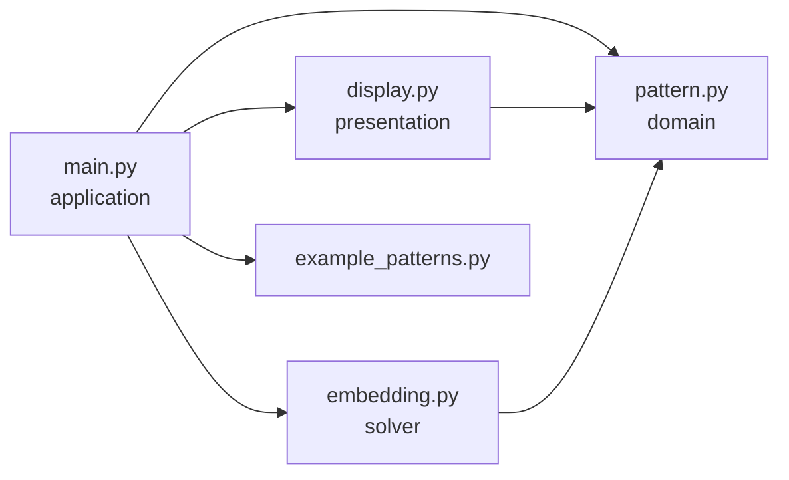

## Crochet Simulator

### Structure

```mermaid
graph LR
  main[main.py<br/>application] --> display[display.py<br/>presentation]
  main --> embedding[embedding.py<br/>solver]
  main --> examples[example_patterns.py]
  main --> pattern[pattern.py<br/>domain]
  display --> pattern
  embedding --> pattern
```
